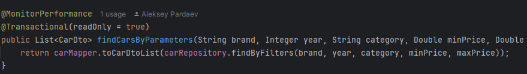

### Руководство по запуску проекта

## Описание проекта
Проект «Автосалон». Реализованы базовые CRUD операции, оптимизированные запросы, спецификации, Criteria API, решена проблема N+1, реализован кэш второго уровня.


## Технологии
- Java: 21
- Hibernate: ORM для работы с базой данных.
- PostgreSQL: Реляционная база данных.
- Docker Compose: Для запуска базы данных PostgreSQL.

## Требования
- Java 21: Убедитесь, что установлена JDK версии 21.
- Docker: Для запуска базы данных.

## Установка

### 1. Клонируйте проект на ваш компьютер:
```bash
git clone <URL_репозитория>
cd <название_проекта>
```

### 2. Поднимите контейнер базы данных
База данных поднимается через Docker Compose. Убедитесь, что Docker и Docker Compose установлены и работают.
```bash
docker-compose up -d
```
Проверьте, что база данных работает:
```bash
docker ps
```

### 3. Проверка работы spring boot starter 


При отправке запроса в консоли видим сообщение

2024-12-16T00:48:32.114+03:00  INFO 28648 --- [nio-8080-exec-1] r.c.aspect.PerformanceMonitorAspect      : Method [List ru.clevertec.service.CarService.findCarsByParameters(String,Integer,String,Double,Double)] executed in [179] ms.
